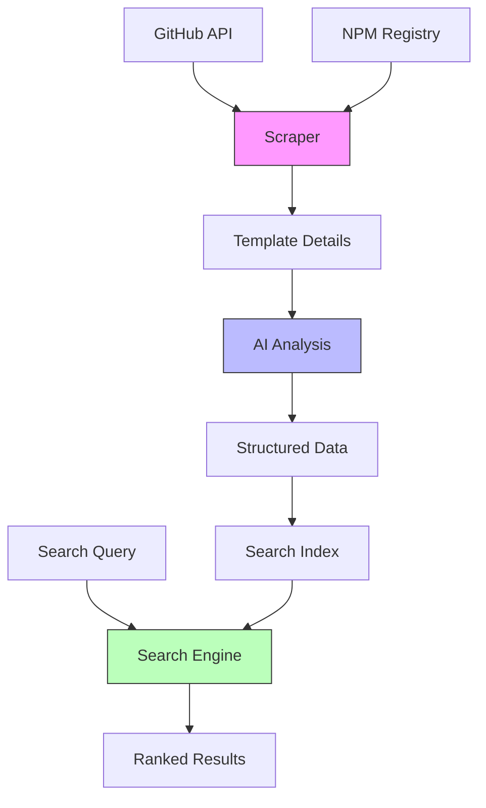

# Starter Template Analysis Tool

A comprehensive tool for discovering, analyzing and searching software starter templates. It helps developers find the right starter template by combining automated scraping, AI analysis, and intelligent search.

## Overview

The tool addresses three key challenges in finding starter templates:
1. Discovery - finding relevant templates across multiple sources
2. Understanding - extracting structured information about features and quality
3. Selection - matching templates to specific project needs

## How It Works



### 1. Template Discovery

The scraper collects starter templates from:
- GitHub repositories (filtered by stars, topics, languages)
- NPM packages (filtered by keywords, downloads)

For each template, it gathers:
- Metadata (stars, forks, last update)
- README content
- Package configurations
- Repository structure

### 2. AI Analysis

Templates are analyzed using a structured ontology that defines:

**Technologies**
- Programming languages
- Frameworks
- Libraries
- Build tools

**Purposes**
- Primary use cases (frontend, backend, full-stack)
- Specific domains (UI components, API servers, etc.)
- Development focus (production, learning, demo)

**Features**
- Development capabilities (hot reload, type checking)
- Testing setup (unit, e2e, coverage)
- Documentation quality
- Maintenance status

The AI analyzes each template against this ontology to extract structured data about its capabilities and quality metrics.

### 3. Search Engine

The search system combines:
- Flexible matching on technologies and purposes
- Feature presence verification
- Quality-based ranking

Results are ordered by:
1. Number of matching criteria
2. Quality metrics (documentation, maintenance)

This helps surface the most relevant and well-maintained templates that match the developer's needs.

## MCP

TBD

## CLI

The CLI provides three main commands:

### Scraping Starters

Scrape starter templates from GitHub:
```bash
slot scrape github <token> [options]

Options:
  -s, --stars <number>     Minimum stars (default: 50)
  -t, --topics <items>     Topics to search for (comma-separated)
  -L, --languages <items>  Languages to search for (comma-separated)
  -b, --batch <size>       Batch size for parallel processing
  -d, --delay <ms>        Delay between requests
  -r, --rph <limit>       Requests per hour limit
  -l, --limit <number>    Maximum results to fetch
```

Scrape starter templates from NPM:
```bash
slot scrape npm [options]

Options:
  -k, --keywords <items>   Keywords to search for (comma-separated)
  -b, --batch <size>      Batch size for parallel processing
  -d, --delay <ms>        Delay between requests
  -r, --rph <limit>       Requests per hour limit
  -l, --limit <number>    Maximum results to fetch
```

### Analyzing Starters

Analyze scraped starters using AI:
```bash
slot analyze [options]

Options:
  -f, --force    Force reanalysis of all templates
```

The analysis extracts:
- Technology stack
- Purpose categories
- Feature detection
- Quality metrics:
  - Documentation completeness
  - Setup instructions
  - Example coverage
  - Commit frequency
  - Issue response time

### Searching Starters

Search analyzed starters with flexible matching:
```bash
slot search [options]

Options:
  -t, --technologies <items>  Technologies to search for (comma-separated)
  -p, --purposes <items>      Purposes to search for (comma-separated key:value pairs)
  -f, --features <items>      Features to search for (comma-separated paths)
  -l, --limit <number>        Maximum number of results (default: 10)
```

Example searches:
```bash
# Find React starters with TypeScript
slot search -t react,typescript

# Find UI component libraries
slot search -p framework:react,ui:component

# Find starters with specific features
slot search -t react -f development.hotReload,testing.unit

# Complex search with multiple criteria
slot search -t react,typescript,webpack -p framework:react,ui:material -f development.typeChecking -l 20
```

Results are ranked by:
1. Number of matching criteria
2. Quality score (based on documentation and maintenance metrics)

## Configuration

Default settings can be configured in `config.js`:
- Rate limiting for APIs
- Default search parameters
- Minimum quality thresholds
- Output directories 