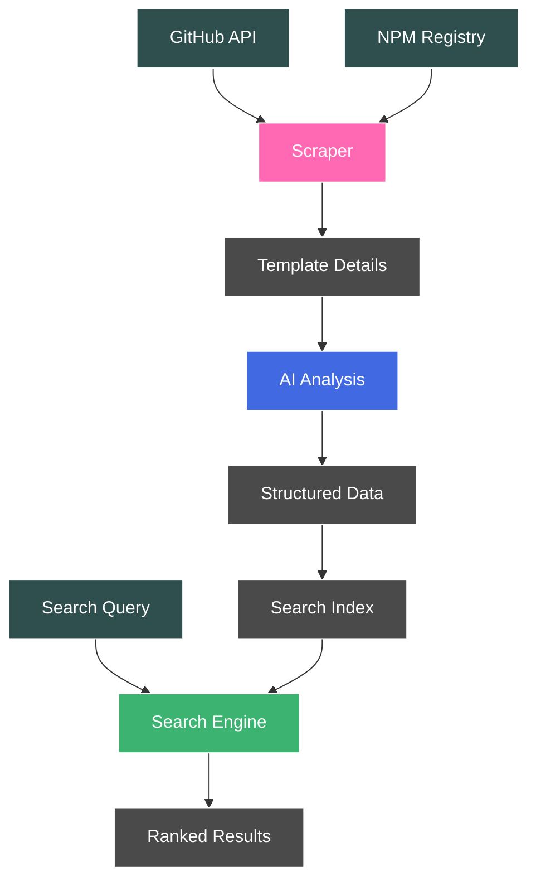

# Slot: A Place to Put Your Tokens


Slot is an MCP (Model Context Protocol) server that enables developers to search and discover starter templates directly from within Claude Desktop and other LLM applications. By integrating with your AI assistant's workflow, Slot helps you find the perfect starter template while discussing architecture and project setup.

Think of it as an intelligent template discovery system that:
- Lives inside your AI assistant
- Understands your project requirements
- Finds relevant starter templates
- Explains their tradeoffs
- Helps you make informed decisions

## Overview

The tool addresses three key challenges in finding starter templates:
1. Discovery - finding relevant templates across multiple sources
2. Understanding - extracting structured information about features and quality
3. Selection - matching templates to specific project needs

## How It Works



### 1. Template Discovery

The scraper collects starter templates from:
- GitHub repositories (filtered by stars, topics, languages)
- NPM packages (filtered by keywords, downloads)

For each template, it gathers:
- Metadata (stars, forks, last update)
- README content
- Package configurations
- Repository structure

### 2. AI Analysis

Templates are analyzed using a structured ontology that defines:

**Technologies**
- Programming languages
- Frameworks
- Libraries
- Build tools

**Purposes**
- Primary use cases (frontend, backend, full-stack)
- Specific domains (UI components, API servers, etc.)
- Development focus (production, learning, demo)

**Features**
- Development capabilities (hot reload, type checking)
- Testing setup (unit, e2e, coverage)
- Documentation quality
- Maintenance status

The AI analyzes each template against this ontology to extract structured data about its capabilities and quality metrics.

### 3. Search Engine

The search system combines:
- Flexible matching on technologies and purposes
- Feature presence verification
- Quality-based ranking

Results are ordered by:
1. Number of matching criteria
2. Quality metrics (documentation, maintenance)

This helps surface the most relevant and well-maintained templates that match the developer's needs.

## MCP

This project includes an MCP (Model Context Protocol) server that allows you to use the starter template search functionality directly from Claude Desktop.

### Setup

1. Clone the repository:
```bash
git clone https://github.com/yourusername/slot-starters.git
cd slot-starters
```

2. Install dependencies:
```bash
npm install
```

3. Set your OpenAI API key and configure Claude Desktop:
```bash
# Set your OpenAI API key
export OPENAI_API_KEY="your-api-key-here"

# Create Claude Desktop config with the key
mkdir -p ~/Library/Application\ Support/Claude && cat > ~/Library/Application\ Support/Claude/claude_desktop_config.json << EOL
{
  "mcpServers": {
    "slot-starters": {
      "command": "node",
      "args": [
        "$(pwd)/server.js"
      ],
      "env": {
        "OPENAI_API_KEY": "$OPENAI_API_KEY"
      }
    }
  }
}
EOL
```
   - Replace `your-api-key-here` with your actual OpenAI API key
   - Note: This command assumes you're in the project directory. If not, replace `$(pwd)` with the absolute path to your project

4. Restart Claude Desktop to load the new configuration

### Available Tools

Once configured, Claude will have access to the following tools:

- `search_starters`: Search for starter templates using technologies, purposes, and features
  - Example: "Find me React starters that use TypeScript and have hot reload"

The search results will include:
- Template name and URL
- Technologies used
- Primary purposes
- Match score and quality metrics

## CLI

The CLI provides three main commands:

### Scraping Starters

Scrape starter templates from GitHub:
```bash
slot scrape github <token> [options]

Options:
  -s, --stars <number>     Minimum stars (default: 50)
  -t, --topics <items>     Topics to search for (comma-separated)
  -L, --languages <items>  Languages to search for (comma-separated)
  -b, --batch <size>       Batch size for parallel processing
  -d, --delay <ms>        Delay between requests
  -r, --rph <limit>       Requests per hour limit
  -l, --limit <number>    Maximum results to fetch
```

Scrape starter templates from NPM:
```bash
slot scrape npm [options]

Options:
  -k, --keywords <items>   Keywords to search for (comma-separated)
  -b, --batch <size>      Batch size for parallel processing
  -d, --delay <ms>        Delay between requests
  -r, --rph <limit>       Requests per hour limit
  -l, --limit <number>    Maximum results to fetch
```

### Analyzing Starters

Analyze scraped starters using AI:
```bash
slot analyze [options]

Options:
  -f, --force    Force reanalysis of all templates
```

The analysis extracts:
- Technology stack
- Purpose categories
- Feature detection
- Quality metrics:
  - Documentation completeness
  - Setup instructions
  - Example coverage
  - Commit frequency
  - Issue response time

### Searching Starters

Search analyzed starters with flexible matching:
```bash
slot search [options]

Options:
  -t, --technologies <items>  Technologies to search for (comma-separated)
  -p, --purposes <items>      Purposes to search for (comma-separated key:value pairs)
  -f, --features <items>      Features to search for (comma-separated paths)
  -l, --limit <number>        Maximum number of results (default: 10)
```

Example searches:
```bash
# Find React starters with TypeScript
slot search -t react,typescript

# Find UI component libraries
slot search -p framework:react,ui:component

# Find starters with specific features
slot search -t react -f development.hotReload,testing.unit

# Complex search with multiple criteria
slot search -t react,typescript,webpack -p framework:react,ui:material -f development.typeChecking -l 20
```

Results are ranked by:
1. Number of matching criteria
2. Quality score (based on documentation and maintenance metrics)

## Configuration

Default settings can be configured in `config.js`:
- Rate limiting for APIs
- Default search parameters
- Minimum quality thresholds
- Output directories 

## Appendix

### Template Analysis Ontology

The following schema defines how starter templates are analyzed and structured:

```json
{
  "metadata": {
    "name": "string",
    "source": {
      "type": "enum",
      "values": ["github", "npm"]
    },
    "url": "string",
    "stars": "number",
    "forks": "number",
    "lastUpdate": "date"
  },
  "technologies": {
    "type": "array",
    "description": "Flat list of all technologies, tools, and frameworks used",
    "examples": [
      "react", "typescript", "tailwind", "jest", "vite", "docker",
      "postgres", "prisma", "next-auth", "eslint", "prettier"
    ]
  },
  "purposes": {
    "type": "object",
    "description": "Maps technologies to their roles in the template",
    "examples": {
      "ui": "react",
      "styling": "tailwind",
      "database": "postgres",
      "orm": "prisma",
      "testing": "jest",
      "bundling": "vite"
    }
  },
  "features": {
    "development": {
      "hotReload": "boolean",
      "watchMode": "boolean",
      "debugConfig": "boolean",
      "devContainer": "boolean",
      "typeChecking": "boolean",
      "linting": "boolean",
      "formatting": "boolean"
    },
    "testing": {
      "unitTests": "boolean",
      "integrationTests": "boolean",
      "e2eTests": "boolean",
      "cicd": "boolean"
    },
    "deployment": {
      "envConfig": "boolean",
      "dockerfile": "boolean",
      "infraAsCode": "boolean",
      "productionOptimized": "boolean"
    },
    "security": {
      "dependencyScanning": "boolean",
      "secretManagement": "boolean",
      "authentication": "boolean"
    }
  },
  "quality": {
    "maintenance": {
      "commitFrequency": {
        "type": "scale",
        "range": [1, 5]
      },
      "issueResponseTime": {
        "type": "scale",
        "range": [1, 5]
      }
    },
    "documentation": {
      "readmeCompleteness": {
        "type": "scale",
        "range": [1, 5]
      },
      "setupInstructions": {
        "type": "scale",
        "range": [1, 5]
      },
      "exampleCoverage": {
        "type": "scale",
        "range": [1, 5]
      }
    }
  },
  "other": {
    "type": "object",
    "description": "Important information that doesn't fit elsewhere"
  }
}
``` 