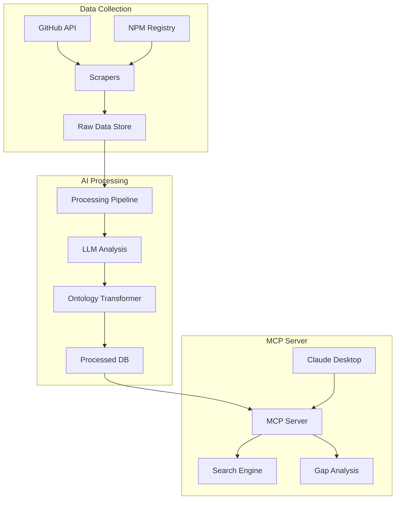

# Slot: a place to put your tokens

## AI-Powered Starter Template Discovery

## Objective

Create an intelligent system that helps developers find and evaluate starter templates for their projects by combining web scraping, AI-powered metadata analysis, and direct LLM integration via the Model Context Protocol (MCP).

## Target User
AI-augmented developers who:
- Use AI assistants (particularly Claude) for architectural discussions
- Need to quickly bootstrap new projects
- Want to make informed decisions about starter templates
- Value having context about template tradeoffs

## User Stories & Acceptance Criteria

### Template Discovery

**Story 1:**

_As a developer discussing architecture with Claude, 
I want to discover relevant starter templates during our conversation
so that I can make informed decisions about project bootstrapping._

**Acceptance Criteria:**
   - Claude can query templates based on current conversation context
   - Results include both exact and similar matches with explanations
   - Each result includes a confidence score
   - Templates can be filtered by tech stack, features, and complexity

**Story 2:**

_As a developer evaluating a template,
I want to understand what additional work I'll need to do
so that I can accurately estimate project setup time._

**Acceptance Criteria:**
   - Each template includes a gap analysis of missing features
   - Integration requirements are clearly listed
   - Complexity of missing features is estimated
   - Alternative templates are suggested if gaps are too large

**Story 3:**

_As a developer comparing templates,
I want to see side-by-side comparisons
so that I can choose the best foundation for my project._

**Acceptance Criteria:**
   - Templates can be compared on key metrics
   - Differences in architecture are highlighted
   - Trade-offs are clearly explained
   - Community metrics (stars, issues, last update) are included

### Template Indexing

**Story 4:**
_As a system administrator,
I want to keep the template database current
so that developers always have access to the latest starters._

**Acceptance Criteria:**
   - CLI supports incremental updates
   - Failed scrapes are logged and can be retried
   - Rate limits are respected
   - Progress is clearly displayed
   - Results are deduplicated

**Story 5:**

_As a system administrator,
I want to transform raw template data into a consistent format
so that it can be effectively searched and compared._

**Acceptance Criteria:**
   - AI pipeline processes new templates automatically
   - Metadata is normalized to a standard schema
   - READMEs are analyzed for key features
   - Quality scores are generated
   - Manual corrections can be applied

**Story 6:**

_As an AI assistant,
I want to understand the context and capabilities of each template
so that I can make relevant recommendations during architecture discussions._

**Acceptance Criteria:**
   - Templates are classified by architectural patterns
   - Feature sets are clearly defined
   - Integration points are identified
   - Complexity levels are assessed
   - Use cases are documented

## Architecture



## Important Technical Decisions

### 1. Technology Stack
- **Language**: TypeScript/Node.js
  - clear examples of prior art for MCP implementations
  - Large ecosystem for API integrations including GitHub, NPM, etc.
  - Native async/await for handling API calls in parallel
  - Strong JSON support for data processing
  - Extensive CLI tooling libraries

- **Storage**: Flat File System
  - Scales to the size of our dataset
  - best for unstructured text data (README, etc.)
  - Simple to implement and maintain
  - Good for version control
  - Easy to inspect and debug
  - Supports incremental updates

- **LLM Choice**: GPT-4 / Gemini Pro
  - Superior code understanding
  - Consistent structured output
  - Good at extracting features from documentation
  - Cost-effective for batch processing
  - Reliable JSON generation

### 2. Risk Mitigation
- Rate limiting with exponential backoff
- Parallel processing with configurable batches
- Caching to reduce API calls
- Validation of AI-generated metadata
- Fallback strategies for API failures

## Interface

### CLI Interface
```bash
# Scraping Commands
slot scrape github <token> [options]
slot scrape npm [options]

# Analysis Commands
slot analyze [--force] [--model gpt4|gemini]
slot validate [--interactive]

# MCP Commands
slot serve [--port] [--host]
```

Common options:
- `--batch`: Batch size for parallel processing
- `--delay`: Delay between requests
- `--limit`: Maximum items to process
- `--output`: Output directory

### MCP Interface
```typescript
interface MCPCapabilities {
  search: {
    byStack: string[];    // Tech stack components
    byFeature: string[];  // Specific features
    byPattern: string[];  // Architecture patterns
  };
  compare: {
    templates: string[];  // Template IDs
    aspects: string[];    // Comparison aspects
  };
  analyze: {
    gaps: string[];      // Missing features
    integrations: string[]; // Required integrations
  };
}
```

Example MCP queries:
```json
{
  "query": "Find React templates with GraphQL support",
  "filters": {
    "stack": ["react", "graphql"],
    "minStars": 100
  }
}
```

## Challenges & Solutions

### Scraping at Scale
**Challenge**: Rate limits, API constraints, data volume  
**Solution**: Technical spike demonstrated success with:
- Parallel processing with configurable batch sizes
- Smart rate limiting
- Deduplication
- Progress tracking
- Configurable filters

### Template Analysis & Ontology
**Challenge**: Creating a consistent structure and extracting meaningful features from diverse templates  
**Solution**:
- Use LLM to analyze READMEs and code structure
- Two-phase analysis:
  1. Initial pass to identify common patterns
  2. Second pass to extract structured data
- Standardized ontology fields:
  - Core tech stack
  - Architecture patterns
  - Integration points
  - Deployment targets
  - Feature completeness
- Validation pipeline:
  - Automated consistency checks
  - Manual review triggers
  - Version control for ontology
- Support for:
  - Human corrections
  - Ontology evolution
  - Confidence scores

## AI-Enabled Features

### 1. Intelligent Ontology Population
- LLM analyzes template structure and documentation
- Extracts key features and patterns
- Maps to standardized ontology
- Identifies architectural decisions
- Infers template complexity and use cases

### 2. Claude Desktop Integration (MCP)
- Real-time template discovery during architecture discussions
- Contextual understanding of developer needs
- Intelligent template comparison
- Gap analysis for missing features
- Integration recommendations
- Natural language template search

## Success Metrics
- Number of templates indexed
- Search result relevance
- Template ontology coverage
- User satisfaction with recommendations
- Time saved in project bootstrapping
- Accuracy of gap analysis
